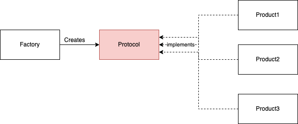
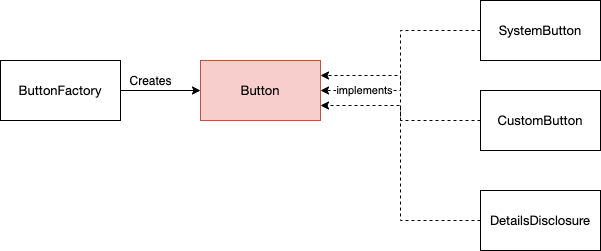
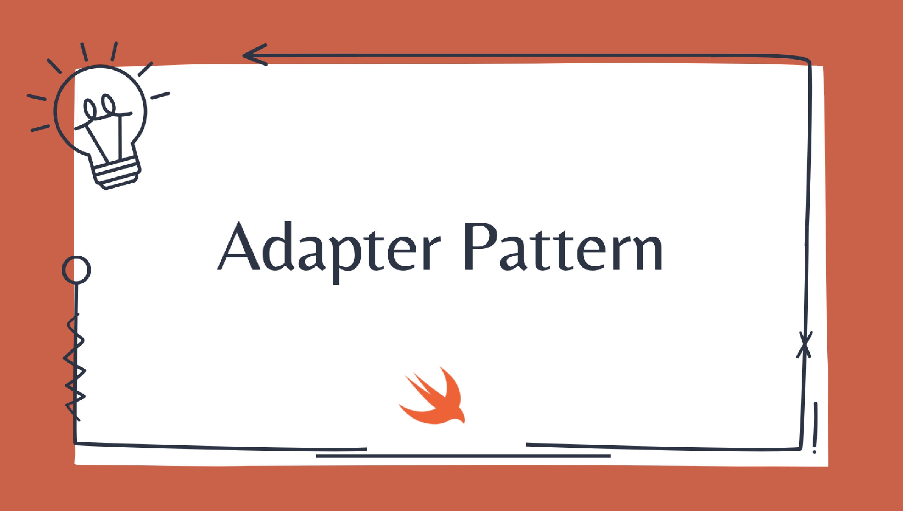
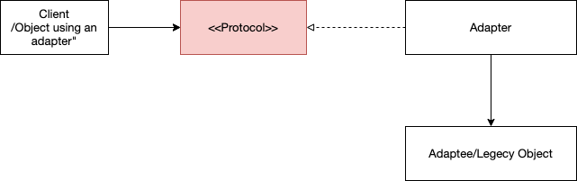
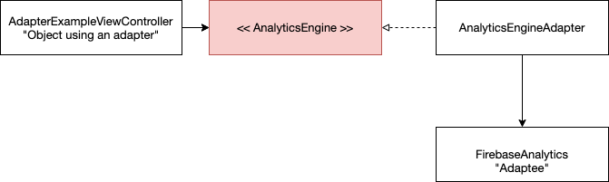

# Design-Patterns

## Factory Pattern
## [ Factory Pattern on YouTube](https://youtu.be/zZ7Yu2B9N40)
[](https://youtu.be/zZ7Yu2B9N40)

its one of a <b>Creational Patterns</b> which consist of:
- <b>Factory:</b> which creates objects.
- <b>Protocol:</b> which defines the methods that the products should implement.
- <b>Products:</b> the objects that are created

<h6 align="left">UML Digram's Example:</h6>

[](https://youtu.be/zZ7Yu2B9N40)

## Delegation Pattern
## [ Delegation Pattern on YouTube](https://youtu.be/-rZIJxm8B0s)
[](https://youtu.be/-rZIJxm8B0s)
its one of a <b>Behavioral Patterns</b> because it's all about objects communication[one-to-one] which consist of three parts:
- <b>Delegating object:</b> It’s the object that has a delegate. The delegate is usually held as a weak property to avoid a retain cycle.
- <b>Delegate protocol:</b> which defines the methods that the delegate should implement.
- <b>Delegate:</b> This is the helper object that implements the delegate protocol.

[](https://youtu.be/-rZIJxm8B0s)
<h6 align="left">Example 1 UML Digram:</h6>which represents communication between View Controller and its Service

[]()

<h6 align="left">Example 2 UML Digram:</h6> which represents communication between View Controller and Presenter

[]()

## Adapter Pattern
## [ Adapter Pattern on YouTube](https://youtu.be/3TPtH6z6qpM)
[](https://youtu.be/3TPtH6z6qpM)

its one of a <b>Behavioral Patterns</b> which consist of four parts:
- <b>Client:</b> Object using an adapter and depends on the protocol
- <b>protocol:</b> which defines the methods we need 
- <b>Adaptee/legacy object:</b> cannot be modified directly so we need add extension or create new adapter
- <b>adapter:</b> which helps us to make the incompatible objects deal with each other

[](https://youtu.be/3TPtH6z6qpM)
<h6 align="left">UML Digram's Example:</h6>

[](https://youtu.be/3TPtH6z6qpM)
```
protocol Target {
    func request()
}

class Adaptee {
    func specificRequest() {
        print("Specific request")
    }
}

class Adapter: Target {
    private let adaptee: Adaptee

    init(adaptee: Adaptee) {
        self.adaptee = adaptee
    }

    func request() {
        adaptee.specificRequest()
    }
}

let adaptee = Adaptee()
let adapter = Adapter(adaptee: adaptee)

adapter.request() // Prints "Specific request"
```
