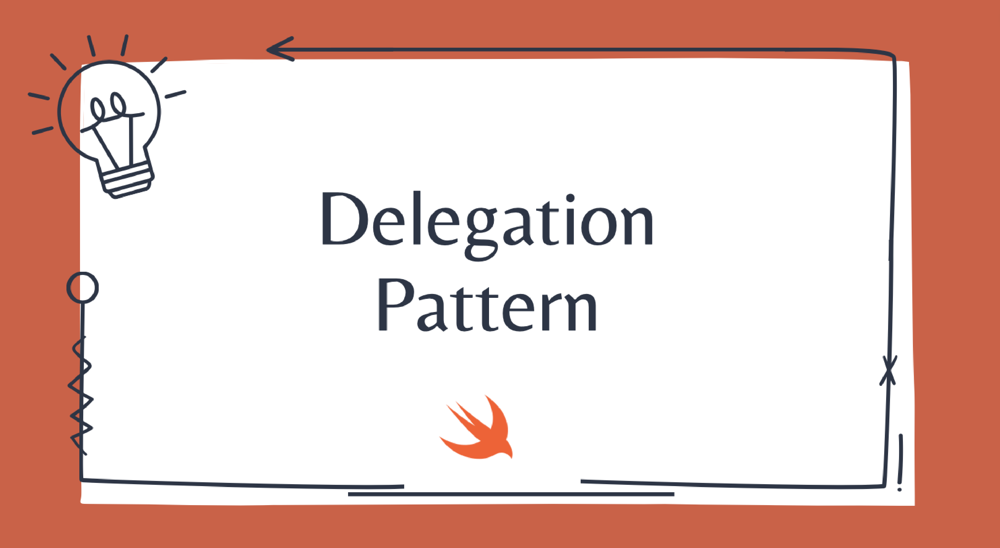
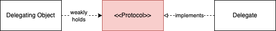
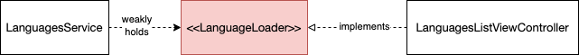
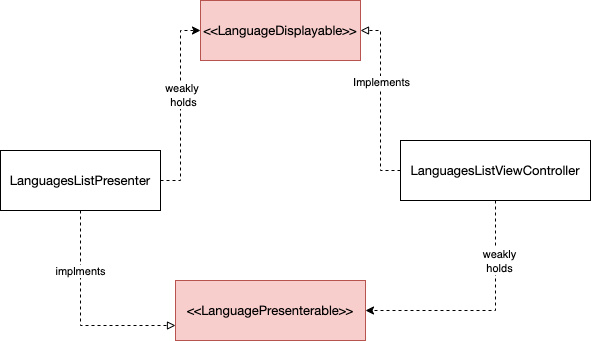

# Design-Patterns

## Delegation Pattern
## [ Delegation Pattern on YouTube]()

its one of a <b>Behavioral Patterns</b> because it's all about objects communication[one-to-one] which consist of three parts:
- <b>Delegating object:</b> It’s the object that has a delegate. The delegate is usually held as a weak property to avoid a retain cycle.
- <b>Delegate protocol:</b> which defines the methods that the delegate should implement.
- <b>Delegate:</b> This is the helper object that implements the delegate protocol.

<h2 align="left">Example 1 UML Digram:</h2>which represents communication between View Controller and its Service

<h2 align="left">Example 2 UML Digram:</h2> which represents communication between View Controller and Presenter

